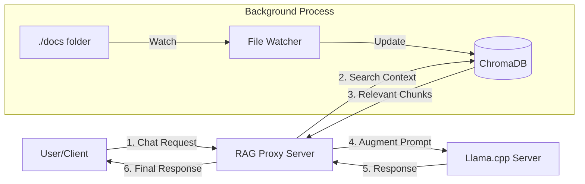

# Project Plan: RAG Proxy Server

## 1. Executive Summary
The goal is to build a lightweight, self-contained **RAG (Retrieval-Augmented Generation) Proxy Server**. This service acts as a transparent middleware between an OpenAI-compatible client (like a chatbot UI or script) and a backend LLM server (specifically `llama.cpp`).

It automates the entire knowledge management lifecycle: simply dropping a file into a folder makes it available to the LLM as context immediately.

## 2. Core Architecture
The system follows a "Proxy & Inject" pattern:

## 3. Key Requirements

### A. Zero-Touch Indexing (The "Magic" Folder)
- **Real-time Monitoring**: The system must watch a specific directory (`./docs`) recursively.
- **CRUD Handling**:
  - **Create/Modify**: Immediately read, chunk, and vector-embed the file.
  - **Delete**: Remove associated chunks from the vector database to prevent hallucinations.
  - **Move/Rename**: Atomically update the index (treat as delete + create) or update metadata.
- **File Hash Detection**: Avoid re-indexing files if their content hasn't changed (even if the timestamp has).

### B. Intelligent Retrieval
- **Smart Chunking**: Split text by semantic boundaries (sentences) rather than arbitrary characters to preserve meaning.
- **Hybrid Search**:
  1. **Semantic Search**: Retrieve top K candidates using cosine similarity (`sentence-transformers`).
  2. **Reranking**: Refine results using a Cross-Encoder model to ensure the highest relevance for the final context window.

### C. Seamless Compatibility
- **OpenAI API Interface**: The server must expose `POST /v1/chat/completions` matching the OpenAI spec.
- **Transparent Proxying**:
  - Forward user configurations (temperature, max_tokens, etc.).
  - Handle **Streaming** responses correctly (server-sent events).
- **Source Attribution**: Return metadata about which files were used in the response (injected into the final JSON or non-streaming response).

## 4. Technical Stack
- **Server**: FastAPI (Python)
- **Vector Store**: ChromaDB (Persistent, local)
- **Embeddings**: `all-MiniLM-L6-v2` (Fast, local)
- **Reranker**: `ms-marco-MiniLM-L-6-v2`
- **File Watching**: `watchdog` library
- **Document Parsing**: `pypdf`, `python-docx`, and plain text fallbacks.

## 5. Roadmap & Refactoring
*Current Status: Functional Single-Script Prototype*

### Phase 1: Modularization (Immediate Next Step)
Refactor the monolithic script into a maintainable package structure:
- `app/api.py`: FastAPI routes and request handling.
- `app/engine.py`: Core RAG logic (retrieval, augmentation).
- `app/indexer.py`: File watching and processing logic.
- `app/store.py`: ChromaDB wrapper and query logic.
- `app/utils.py`: Chunking and hashing utilities.

### Phase 2: Robustness
- Add comprehensive error handling for corrupt files.
- Implement a queue system for indexing (to prevent server stalls during massive file operations).
- Add Unit Tests for the chunker and retriever.

### Phase 3: Advanced Features
- **Web UI**: A simple page to view indexed files and testing queries.
- **Filtering**: Allow users to query specific subfolders or file types via API parameters.
