# Architecture

How Agent CLI works under the hood.

## System Overview

Agent CLI is built around a modular service architecture where different AI capabilities are provided by interchangeable backends.


## Provider System

Each AI capability (ASR, LLM, TTS) has multiple backend providers:

### ASR (Automatic Speech Recognition)

| Provider | Implementation | GPU Support | Latency |
|----------|---------------|-------------|---------|
| `wyoming` | Wyoming Faster Whisper | CUDA/Metal | Low |
| `openai` | OpenAI Whisper API | Cloud | Medium |

### LLM (Large Language Model)

| Provider | Implementation | GPU Support | Privacy |
|----------|---------------|-------------|---------|
| `ollama` | Ollama (local) | CUDA/Metal | Full |
| `openai` | OpenAI API | Cloud | Partial |
| `gemini` | Google Gemini API | Cloud | Partial |

### TTS (Text-to-Speech)

| Provider | Implementation | Quality | Speed |
|----------|---------------|---------|-------|
| `wyoming` | Wyoming Piper | Good | Fast |
| `openai` | OpenAI TTS | Excellent | Medium |
| `kokoro` | Kokoro TTS | Good | Fast |

## Wyoming Protocol

Agent CLI uses the [Wyoming Protocol](https://github.com/rhasspy/wyoming) for local AI services. Wyoming provides a simple TCP-based protocol for:

- Speech-to-text (ASR)
- Text-to-speech (TTS)
- Wake word detection

### Default Ports

| Service | Port | Protocol |
|---------|------|----------|
| Whisper (ASR) | 10300 | Wyoming |
| Piper (TTS) | 10200 | Wyoming |
| OpenWakeWord | 10400 | Wyoming |
| Ollama (LLM) | 11434 | HTTP |

## Audio Pipeline

```mermaid
graph LR
    subgraph Input
        mic["🎤 Microphone"]
    end

    subgraph Processing
        capture["sounddevice<br/>capture"]
        wav1["WAV buffer"]
        asr["Wyoming ASR"]
        tts["Wyoming TTS"]
        wav2["WAV buffer"]
        playback["sounddevice<br/>playback"]
    end

    subgraph Output
        speaker["🔊 Speakers"]
    end

    mic --> capture --> wav1 --> asr
    tts --> wav2 --> playback --> speaker
```



## Configuration Loading

Configuration is loaded from multiple sources with the following precedence:

1. **Command-line arguments** (highest priority)
2. **Environment variables** (`OPENAI_API_KEY`, etc.)
3. **Config file** (`./agent-cli-config.toml` or `~/.config/agent-cli/config.toml`)
4. **Default values** (lowest priority)

## Process Management

Commands that run as background processes use a PID file system:

```
~/.cache/agent-cli/
├── transcribe.pid
├── voice-edit.pid
├── chat.pid
└── assistant.pid

~/.config/agent-cli/
├── config.toml              # Configuration
├── audio/                   # Saved recordings (transcribe-daemon)
├── history/                 # Chat history
├── transcriptions/          # Saved WAV files
└── transcriptions.jsonl     # Transcription log
```

## Memory System

See [Memory System Architecture](memory.md) for details on the long-term memory implementation.

## RAG System

See [RAG System Architecture](rag.md) for details on the document retrieval system.

## Dependencies

### Core Dependencies

- **typer** - CLI framework
- **pydantic-ai-slim** - AI agent framework with tool support
- **sounddevice** - Audio I/O
- **pyperclip** - Clipboard access
- **rich** - Terminal formatting
- **wyoming** - Protocol for local AI services
- **openai** - OpenAI API client
- **google-genai** - Google Gemini API client

### Optional Dependencies

- **silero-vad** - Voice activity detection (for `transcribe-daemon`)
- **chromadb** - Vector database (for RAG and memory)
- **markitdown** - Document parsing (for RAG)

## Platform Support

| Platform | Status | Notes |
|----------|--------|-------|
| macOS (Apple Silicon) | Full | Metal GPU acceleration |
| macOS (Intel) | Full | CPU-only |
| Linux (x86_64) | Full | NVIDIA GPU support |
| Linux (ARM) | Partial | CPU-only |
| Windows (WSL2) | Full | Via WSL2 |
| Windows (Native) | Experimental | Limited testing |
