# assistant

A hands-free voice assistant that activates on a wake word.

## Usage

```bash
agent-cli assistant [OPTIONS]
```

## Description

This agent continuously listens for a wake word (e.g., "Hey Nabu"):

1. Run the command—it starts listening for the wake word
2. Say the wake word to start recording
3. Speak your command or question
4. Say the wake word again to stop recording
5. The agent transcribes, sends to the LLM, and speaks the response
6. Immediately returns to listening for the wake word

## Examples

```bash
# Start with default wake word
agent-cli assistant --input-device-index 1

# With custom wake word
agent-cli assistant --wake-word "hey_jarvis" --input-device-index 1

# With TTS responses
agent-cli assistant --tts --input-device-index 1

# Custom wake word server
agent-cli assistant --wake-server-ip 192.168.1.100 --wake-server-port 10400
```

## Options

### Wake Word Configuration

| Option | Description | Default |
|--------|-------------|---------|
| `--wake-word` | Wake word name (e.g., 'ok_nabu', 'hey_jarvis') | `ok_nabu` |
| `--wake-server-ip` | Wyoming wake word server IP | `localhost` |
| `--wake-server-port` | Wyoming wake word server port | `10400` |

### Provider Selection

| Option | Description | Default |
|--------|-------------|---------|
| `--asr-provider` | ASR provider: `wyoming`, `openai` | `wyoming` |
| `--llm-provider` | LLM provider: `ollama`, `openai`, `gemini` | `ollama` |
| `--tts-provider` | TTS provider: `wyoming`, `openai`, `kokoro` | `wyoming` |

### Audio Configuration

| Option | Description |
|--------|-------------|
| `--input-device-index` | Index of audio input device |
| `--input-device-name` | Input device name keywords |
| `--output-device-index` | Index of audio output device |
| `--output-device-name` | Output device name keywords |
| `--list-devices` | List available devices |

### TTS Options

| Option | Description | Default |
|--------|-------------|---------|
| `--tts` / `--no-tts` | Enable text-to-speech responses | `false` |
| `--tts-speed` | Speech speed multiplier | `1.0` |
| `--save-file PATH` | Save TTS audio to file | - |

### Output Options

| Option | Description | Default |
|--------|-------------|---------|
| `--clipboard` / `--no-clipboard` | Copy result to clipboard | `true` |

### Process Management

| Option | Description |
|--------|-------------|
| `--stop` | Stop running assistant |
| `--status` | Check if assistant is running |
| `--toggle` | Toggle assistant on/off |

## Available Wake Words

The default OpenWakeWord server supports:

- `ok_nabu` (default)
- `hey_jarvis`
- `alexa`
- `hey_mycroft`

Custom wake words can be trained and added to the OpenWakeWord server.

## Interaction Flow

```mermaid
graph TD
    listen["🎧 Listening for wake word<br/>'ok_nabu'"]
    record["🎤 Recording speech<br/>(speak your question)"]
    process["⚙️ Transcribe → LLM → TTS"]

    listen -->|"Wake word detected"| record
    record -->|"Wake word again OR silence"| process
    process -->|"Done"| listen
```



## Tips

- Speak clearly after the wake word is detected
- Wait for the TTS response to finish before saying the wake word again
- Use `--tts` for a more natural conversation experience
