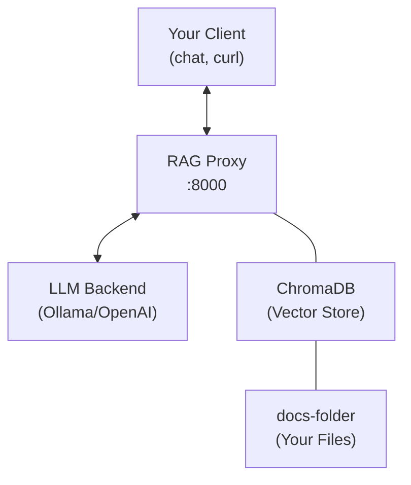

# rag-proxy

A RAG (Retrieval-Augmented Generation) proxy server that lets you chat with your documents.

## Usage

```bash
agent-cli rag-proxy [OPTIONS]
```

## Description

Enables "Chat with your Data" by running a local proxy server:

1. Start the server, pointing to your documents folder and LLM
2. The server watches the folder and indexes documents into a ChromaDB vector store
3. Point any OpenAI-compatible client to this server's URL
4. When you ask a question, the server retrieves relevant chunks and adds them to the prompt

## Installation

Requires the `rag` extra:

```bash
pip install "agent-cli[rag]"
# or from repo
uv sync --extra rag
```

## Examples

```bash
# With local LLM (Ollama)
agent-cli rag-proxy \
  --docs-folder ~/Documents/Notes \
  --openai-base-url http://localhost:11434/v1 \
  --port 8000

# With OpenAI
agent-cli rag-proxy \
  --docs-folder ~/Documents/Notes \
  --openai-api-key sk-... \
  --port 8000

# Use with agent-cli chat
agent-cli chat --openai-base-url http://localhost:8000/v1 --llm-provider openai
```

## Options

### RAG Configuration

| Option | Description | Default |
|--------|-------------|---------|
| `--docs-folder PATH` | Folder to watch for documents | `./rag_docs` |
| `--chroma-path PATH` | ChromaDB persistence directory | `./rag_db` |
| `--limit N` | Number of chunks to retrieve per query | `3` |
| `--rag-tools` / `--no-rag-tools` | Allow agent to fetch full documents | `true` |

### LLM Configuration

| Option | Description |
|--------|-------------|
| `--openai-base-url` | OpenAI-compatible API URL (e.g., Ollama) |
| `--openai-api-key` | OpenAI API key |
| `--embedding-model` | Model for embeddings | `text-embedding-3-small` |

### Server Configuration

| Option | Description | Default |
|--------|-------------|---------|
| `--host` | Host/IP to bind to | `0.0.0.0` |
| `--port` | Port to bind to | `8000` |
| `--log-level` | Logging level | `INFO` |

## Supported Document Types

- Markdown (`.md`)
- Text files (`.txt`)
- PDF files (`.pdf`)

## Architecture



## Usage with Other Clients

Any OpenAI-compatible client can use the RAG proxy:

```bash
# curl
curl http://localhost:8000/v1/chat/completions \
  -H "Content-Type: application/json" \
  -d '{"model": "gpt-4", "messages": [{"role": "user", "content": "What do my notes say about X?"}]}'

# Python (openai library)
from openai import OpenAI
client = OpenAI(base_url="http://localhost:8000/v1", api_key="not-needed")
response = client.chat.completions.create(
    model="gpt-5-mini",
    messages=[{"role": "user", "content": "Summarize my project notes"}]
)
```

## Tips

- The server automatically re-indexes when files change
- Use `--limit` to control how many document chunks are retrieved
- Enable `--rag-tools` for the agent to request full documents when snippets aren't enough
